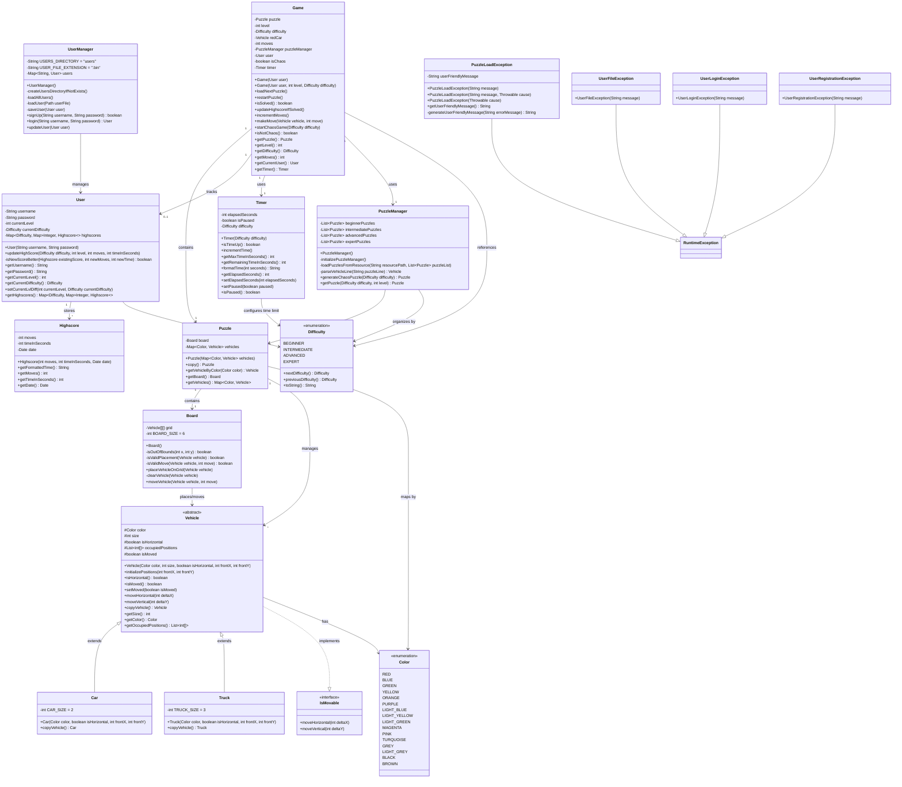

# Rush Hour Game

A JavaFX implementation of the classic Rush Hour puzzle game with multiple difficulty levels, user authentication, and comprehensive game features.


## Table of Contents

- [Overview](#overview)
- [Features](#features)
- [Requirements](#requirements)
- [Installation](#installation)
- [Gameplay](#gameplay)
- [Domain Model](#domain-model)
- [Project Structure](#project-structure)
- [Technical Details](#technical-details)
- [Troubleshooting](#troubleshooting)
- [Credits](#credits)
- [License](#license)

## Overview

Rush Hour is a logic puzzle game where players must navigate a red car through a grid of blocking vehicles to reach the exit. This implementation features four difficulty levels, a timer system, highscore tracking, and both standard and chaos game modes.

## Features

### Core Gameplay

- **Multiple Difficulty Levels**: Beginner, Intermediate, Advanced, Expert
- **4 Levels per Difficulty**: 16 unique puzzles total
- **Chaos Mode**: Randomly scrambled puzzles for unpredictable gameplay
- **Timed Challenges**: Different time limits based on difficulty
- **Move Counter**: Track efficiency with move counting
- **Drag-and-Drop Controls**: Intuitive vehicle movement

### User Management

- **User Authentication**: Sign up, login, and guest mode
- **Progress Tracking**: Automatically saves current level and difficulty
- **Persistent Storage**: User data stored in binary files

### Scoring System

- **Highscore Tracking**: Records best moves and time for each level
- **Date Stamping**: Tracks when highscores were achieved
- **Per-Difficulty Leaderboards**: Separate highscores for each difficulty

### Additional Features

- **Pause/Resume**: Pause gameplay without penalty
- **Level Selection**: Jump to any previously unlocked level
- **Instructions**: Built-in tutorial system
- **Credits**: Team information display

## Requirements

### Software Requirements

- **Java Development Kit (JDK)**: Version 21 or higher
- **JavaFX**: Version 23 or compatible
- **IDE**: IntelliJ IDEA recommended (or any Java IDE)

### JavaFX Dependencies

```xml
<dependencies>
    <dependency>
        <groupId>org.openjfx</groupId>
        <artifactId>javafx-controls</artifactId>
        <version>23</version>
    </dependency>
    <dependency>
        <groupId>org.openjfx</groupId>
        <artifactId>javafx-graphics</artifactId>
        <version>23</version>
    </dependency>
    <dependency>
        <groupId>org.openjfx</groupId>
        <artifactId>javafx-base</artifactId>
        <version>23</version>
    </dependency>
</dependencies>
```

## Installation

### 1. Clone the Repository

```bash
git clone <repository-url>
cd rush_hour
```

### 2. Configure Resources Directory

**CRITICAL**: Mark the `src/main/resources` folder as a Resources Root in your IDE.

**IntelliX IDEA:**
1. Right-click on `src/main/resources`
2. Select "Mark Directory as" → "Resources Root"

**Eclipse:**
1. Right-click on project → "Properties"
2. Navigate to "Java Build Path" → "Source"
3. Add `src/main/resources` as source folder

### 3. Add JavaFX Libraries

**IntelliJ IDEA:**
1. File → Project Structure → Libraries
2. Click "+" → "Java"
3. Navigate to JavaFX SDK lib folder
4. Add all JavaFX JAR files

**Maven**: Use the dependencies shown in the [Requirements](#requirements) section.

### 4. VM Options (if needed)

If JavaFX modules are not recognized, add VM options:

```
--module-path /path/to/javafx-sdk/lib --add-modules javafx.controls,javafx.fxml
```

### 5. Run the Application

Execute `main.java.Main` or `main.java.MainHack` class.

## Gameplay

### Objective

Move the red car to the exit (rightmost position in row 2) by sliding other vehicles out of the way.

### Controls

- **Click and Drag**: Move vehicles horizontally or vertically
- **Pause Button**: Pause/resume the timer
- **Restart Button**: Reset current puzzle
- **Menu Options**: Access level selection, highscores, and settings

### Game Flow

```
┌─────────────┐
│  Login/     │
│  Sign Up    │
└──────┬──────┘
       │
       v
┌─────────────┐
│  Home Menu  │
└──────┬──────┘
       │
       ├──────────────┐
       │              │
       v              v
┌─────────────┐  ┌─────────────┐
│  Play Game  │  │Select Level │
└──────┬──────┘  └──────┬──────┘
       │                │
       └────────┬───────┘
                │
                v
         ┌─────────────┐
         │  Game View  │
         └──────┬──────┘
                │
         ┌──────┴──────┐
         │             │
         v             v
    ┌─────────┐   ┌─────────┐
    │ Solved  │   │Time Up! │
    └────┬────┘   └────┬────┘
         │             │
         v             v
    ┌─────────────────────┐
    │   Next Level /      │
    │   Restart / Menu    │
    └─────────────────────┘
```

### Difficulty Differences

| Difficulty    | Time Limit | Complexity        |
|---------------|------------|-------------------|
| Beginner      | 3:00       | Few vehicles      |
| Intermediate  | 5:00       | Moderate blocking |
| Advanced      | 5:00       | Complex layouts   |
| Expert        | 7:00       | Maximum challenge |

### Chaos Mode

- Randomly scrambles existing puzzles
- Unpredictable vehicle positions
- Great for replay value
- No highscore tracking

## Domain Model



### Key Relationships

- **Game** manages the overall game state, containing a Puzzle, User, Timer, and PuzzleManager
- **Puzzle** contains a Board and a collection of Vehicles mapped by Color
- **Board** maintains a 6x6 grid and handles vehicle placement and movement validation
- **Vehicle** (abstract) is implemented by Car and Truck, each occupying different amounts of space
- **User** tracks progress, current level/difficulty, and maintains a nested map of Highscores
- **PuzzleManager** loads puzzles from resource files and generates chaos mode puzzles
- **Timer** handles countdown logic based on difficulty level

## Project Structure

```
rush_hour/
├── src/
│   ├── main/
│   │   ├── java/
│   │   │   ├── model/
│   │   │   │   ├── enums/
│   │   │   │   │   ├── Color.java
│   │   │   │   │   └── Difficulty.java
│   │   │   │   ├── exceptions/
│   │   │   │   │   ├── PuzzleLoadException.java
│   │   │   │   │   ├── UserFileException.java
│   │   │   │   │   ├── UserLoginException.java
│   │   │   │   │   └── UserRegistrationException.java
│   │   │   │   ├── game/
│   │   │   │   │   ├── Board.java
│   │   │   │   │   ├── Game.java
│   │   │   │   │   ├── Highscore.java
│   │   │   │   │   ├── Puzzle.java
│   │   │   │   │   ├── PuzzleManager.java
│   │   │   │   │   └── Timer.java
│   │   │   │   ├── user/
│   │   │   │   │   ├── User.java
│   │   │   │   │   └── UserManager.java
│   │   │   │   └── vehicles/
│   │   │   │       ├── Car.java
│   │   │   │       ├── IsMovable.java
│   │   │   │       ├── Truck.java
│   │   │   │       └── Vehicle.java
│   │   │   ├── view/
│   │   │   │   ├── chaosview/
│   │   │   │   ├── creditsview/
│   │   │   │   ├── gameview/
│   │   │   │   ├── highscoreview/
│   │   │   │   ├── homemenuview/
│   │   │   │   ├── instructionsview/
│   │   │   │   ├── loginview/
│   │   │   │   └── selectlevelview/
│   │   │   ├── Main.java
│   │   │   └── MainHack.java
│   │   └── resources/          ← MUST BE MARKED AS RESOURCES ROOT
│   │       ├── fonts/
│   │       ├── images/
│   │       ├── puzzles/
│   │       ├── stylesheet/
│   │       └── txtfiles/
│   └── test/
├── users/                      ← Generated at runtime
└── README.md
```

## Technical Details

### Architecture Pattern

**Model-View-Presenter (MVP)**
- **Model**: Business logic and data structures
- **View**: JavaFX UI components
- **Presenter**: Mediates between Model and View

### Key Design Decisions

#### Puzzle Storage

Puzzles are stored in text files with the format:

```
PUZZLE
CAR;RED;true;5;2
TRUCK;BLUE;false;0;0
...
```

#### User Persistence

- Binary serialization for user data
- Separate file per user in `users/` directory
- Automatic directory creation on first run

#### Move Validation

- Board class validates moves before execution
- Checks for out-of-bounds and collisions
- Prevents invalid vehicle positions

#### Timer Implementation

- JavaFX Timeline for countdown
- Pausable without data loss
- Automatic time-up detection

### Exception Handling

Custom exceptions provide user-friendly error messages:

- **PuzzleLoadException**: Issues loading puzzle files
- **UserFileException**: File I/O problems
- **UserLoginException**: Authentication failures
- **UserRegistrationException**: Account creation issues

### Sub-Presenters

GamePresenter delegates responsibilities:

- **VehicleSubPresenter**: Handles vehicle drag-and-drop
- **TimerSubPresenter**: Manages countdown timer

## Troubleshooting

### Resources Not Found

- Ensure `src/main/resources` is marked as Resources Root
- Verify resource files exist in correct folders
- Check file paths use `/` (forward slash)

### JavaFX Runtime Errors

- Confirm JavaFX libraries are properly configured
- Add VM options if modules aren't recognized
- Verify Java version compatibility

### User Data Issues

- Check `users/` directory permissions
- Ensure adequate disk space
- Verify serialization compatibility

### Image Loading Failures

- Confirm vehicle images exist in `resources/images/`
- Check image naming convention matches code
- Verify image format (PNG recommended)

## Credits

**Developed by**: Casper & Romeo  
**Course**: Object-Oriented Programming Project  
**Year**: 2025

## License

© 2025 Casper & Romeo. All rights reserved.